<div align="center">

# 🚀 AERAE Accelerator

### _AI-Powered Risk Assessment & Policy Analysis Platform with RAG + Multi-Provider LLM Support_

<br>

[](https://python.org)
[](https://fastapi.tiangolo.com)
[](https://react.dev)
[](https://typescriptlang.org)
[](https://vite.dev)
[](https://tailwindcss.com)
[](https://sqlmodel.tiangolo.com)
[](https://azure.microsoft.com)
[](https://ai.google.dev)
[](https://python-poetry.org)
[](#-running-tests)
[](https://www.trychroma.com)
[](https://www.openpolicyagent.org)
[](https://gitpython.readthedocs.io)
[](https://github.com/gitleaks/gitleaks)
[](https://pypdf.readthedocs.io)

<br>

</div>

---

<details open>
<summary><b>📑 Table of Contents</b></summary>

&nbsp;&nbsp;[📖 Overview](#-overview)
&nbsp;&nbsp;[✨ Key Features](#-key-features)
&nbsp;&nbsp;[🏗️ Architecture Flow](#️-architecture-flow)
&nbsp;&nbsp;[📁 Repository Structure](#-repository-structure)
&nbsp;&nbsp;[📄 File Descriptions](#-file-descriptions)
&nbsp;&nbsp;[🔌 API Endpoints](#-api-endpoints)
&nbsp;&nbsp;[🖥️ Frontend UI](#️-frontend-ui)
&nbsp;&nbsp;[⚙️ Getting Started](#️-getting-started)
&nbsp;&nbsp;[🔐 Environment Variables](#-environment-variables)
&nbsp;&nbsp;[🧰 Tech Stack](#-tech-stack)
&nbsp;&nbsp;[📜 License](#-license)

</details>

---

## 📖 Overview

**AERAE Accelerator** is a Python monorepo that provides a FastAPI backend capable of generating AI-powered content using **Google Gemini** and **Azure OpenAI** (via EPAM DIAL proxy). It features an intelligent **automatic fallback mechanism** — if Gemini is unavailable (rate-limited, quota exhausted, etc.), the system seamlessly switches to Azure OpenAI, ensuring uninterrupted service.

The platform includes a **project ingestion pipeline** — upload a PDF document and/or provide a GitHub repository URL to automatically extract project metadata, scan for hardcoded secrets using **Gitleaks**, and return a unified `ProjectArtifact` combining document analysis and code intelligence.

A **Retrieval-Augmented Generation (RAG) pipeline** powers the risk-assessment engine: AI-ethics and regulatory policies (covering the **EU AI Act**, **NIST AI RMF**, and **UNESCO Ethics of AI**) are embedded via `text-embedding-3-small` and stored in **ChromaDB**. When a project is analysed, the top-5 most relevant policies are retrieved by vector similarity and fed into **GPT-4o** (with structured JSON output) to produce categorised risk assessments with severity levels.

An **OPA (Open Policy Agent) ethical-gate layer** enforces hard policy constraints: Rego rules automatically block projects that contain hardcoded secrets, carry high/critical-severity risks, use **EU AI Act prohibited practices** (social scoring, real-time biometric, subliminal manipulation), lack a documented **human-in-the-loop** oversight mechanism when high-severity risks are present, or deploy **biometric data** to public cloud environments. The `OPAGatekeeper` async client integrates the OPA REST API directly into the Python backend, and a companion bash script (`eval_gates.sh`) enables CLI-based gate evaluation with mock inputs.

A **full end-to-end assessment pipeline** ties everything together: `POST /api/v1/assess` accepts a **PDF file upload** and **GitHub URL** via `multipart/form-data`, creates a tracked job in SQLite, and immediately returns a UUID. The uploaded PDF is saved to a temporary directory so the background pipeline can process it. A background task sequentially runs **Ingestion** (Git clone + Gitleaks + PDF parsing), **RAG** (embedding → policy search → GPT-4o risk analysis), **Trust Scoring** (algorithmic score with Critical/High/Medium/Low/secret penalties, case-insensitive), and **OPA gate evaluation**. Poll `GET /api/v1/assess/{job_id}` for results — **202** while processing, **200** with the full report when complete.

A **React + TypeScript frontend** built with **Vite** and **Tailwind CSS v4** provides the user interface. Two-route architecture using **React Router**: `/` renders the `AssessmentForm` for submitting a GitHub URL and uploading a PDF file (sent as `multipart/form-data`); `/dashboard/:id` renders the `DashboardPage` which polls the backend for results. A dedicated `Scorecard` component displays the final **Trust Score** as a colour-coded circular gauge (**green** > 80, **yellow** > 50, **red** ≤ 50) along with the **Allow / Deny** policy decision from the OPA gate. The UI uses **Axios** for API communication, **Lucide React** icons (including `ShieldCheck` / `ShieldX` for the gate verdict), and **Recharts** for future data visualisation.

> [!NOTE]
> The platform is designed for **zero-downtime AI inference** — if one provider goes down, the other takes over automatically.

---

## ✨ Key Features

| | Feature | Description |
|:-:|:--------|:------------|
| 🔄 | **Multi-Provider AI** | Gemini + Azure OpenAI with automatic failover |
| ⚡ | **FastAPI** | High-performance async Python API |
| 🧠 | **RAG Pipeline** | Embed policies in ChromaDB, retrieve by similarity, feed to GPT-4o |
| 📊 | **Risk Analysis** | Structured JSON risk assessment (category / severity / reason) via GPT-4o |
| 🔢 | **Embeddings** | Azure OpenAI `text-embedding-3-small` for semantic search |
| 📝 | **PDF Parsing** | Extract text from PDFs via **pypdf**, then analyse with AI for project purpose, data types & risks |
| 🔎 | **Git Scanning** | Clone repos, list files & detect languages automatically |
| 🛡️ | **Secret Detection** | Gitleaks CLI integration to find hardcoded credentials |
| 📦 | **Project Ingestion** | Unified `/ingest` endpoint merging PDF + Git into `ProjectArtifact` |
| 🗄️ | **SQLModel + SQLite** | Lightweight database with auto table creation |
| 🔒 | **Secure Config** | Secrets loaded from git-ignored `.env` file |
| 🧪 | **Fully Tested** | 79 pytest test cases across 12 test modules |
| 📦 | **Poetry** | Modern Python dependency management |
| 🔍 | **ChromaDB** | Persistent vector store with policy document collection |
| 🏛️ | **OPA Policy Gates** | Rego-based ethical gates — secrets, severity, prohibited use cases, human-in-the-loop, biometric deployment |
| 🎯 | **Trust Scoring** | Algorithmic score (100 → 0) penalising Critical (−50), High (−25), Medium (−10) risks & secrets (−15 each) |
| 🔄 | **Async Assessment** | Background pipeline with job tracking (Processing → Complete / Failed) |
| 🏛️ | **Auto-Start OPA** | OPA server auto-launches with the backend and stops on shutdown |
| 🛡️ | **Graceful OPA Fallback** | Pipeline completes with safe defaults if OPA is unreachable |
| 🛡️ | **Type-Safe** | Pydantic models for all request/response schemas |
| ⚛️ | **React Frontend** | Vite + React 19 + TypeScript SPA |
| 🎨 | **Tailwind CSS v4** | Utility-first styling with `@tailwindcss/vite` plugin |
| 📊 | **Trust Score Gauge** | SVG circular gauge — green / yellow / red thresholds |
| �️ | **Scorecard + Gate Verdict** | Reusable Scorecard component with Allow / Deny policy decision |
| 📝 | **Assessment Form** | Card-based form with GitHub URL + PDF file upload |
| 🔄 | **Live Polling** | Dashboard polls every 3s until job completes |
| 📋 | **Rich Results Dashboard** | Collapsible panels for risks, OPA, PDF analysis, repo scan & matched policies |
| 🚦 | **Two-Route SPA** | React Router — `/` (form) and `/dashboard/:id` (results) |
| 🧩 | **Lucide Icons** | Modern icon library integrated throughout the UI |
| 📈 | **Recharts Ready** | Chart library installed for future data visualisation |

---

## 🏗️ Architecture Flow

```mermaid
flowchart TD
    classDef clientStyle fill:#1e293b,stroke:#60a5fa,stroke-width:2px,color:#f8fafc
    classDef routerStyle fill:#0f766e,stroke:#2dd4bf,stroke-width:2px,color:#f8fafc
    classDef geminiStyle fill:#1e40af,stroke:#60a5fa,stroke-width:2px,color:#f8fafc
    classDef azureStyle fill:#7c3aed,stroke:#a78bfa,stroke-width:2px,color:#f8fafc
    classDef successStyle fill:#15803d,stroke:#4ade80,stroke-width:2px,color:#f8fafc
    classDef errorStyle fill:#b91c1c,stroke:#f87171,stroke-width:2px,color:#f8fafc
    classDef decisionStyle fill:#92400e,stroke:#fbbf24,stroke-width:2px,color:#f8fafc
    classDef serviceStyle fill:#374151,stroke:#9ca3af,stroke-width:2px,color:#f8fafc

    A["🌐 Client Request<br><code>POST /api/v1/generate</code>"]:::clientStyle
    B["⚡ FastAPI Router<br><code>routes.py</code>"]:::routerStyle
    C["🤖 Try Gemini First<br><code>gemini_service.py</code>"]:::geminiStyle
    D{{"✅ Gemini<br>Success?"}}:::decisionStyle
    E["✅ Return Response<br><code>source: gemini</code>"]:::successStyle
    F["☁️ Fallback → Azure OpenAI<br><code>azure_openai_service.py</code>"]:::azureStyle
    G{{"✅ Azure<br>Success?"}}:::decisionStyle
    H["✅ Return Response<br><code>source: azure-openai</code><br><code>fallback: true</code>"]:::successStyle
    I["❌ 502 Error<br>Both Providers Failed"]:::errorStyle

    A --> B
    B --> C
    C --> D
    D -- "✅ Yes" --> E
    D -- "❌ No (429 / Error)" --> F
    F --> G
    G -- "✅ Yes" --> H
    G -- "❌ No" --> I
```



### 📥 Project Ingestion Flow

```mermaid
flowchart TD
    classDef clientStyle fill:#1e293b,stroke:#60a5fa,stroke-width:2px,color:#f8fafc
    classDef routerStyle fill:#0f766e,stroke:#2dd4bf,stroke-width:2px,color:#f8fafc
    classDef serviceStyle fill:#374151,stroke:#9ca3af,stroke-width:2px,color:#f8fafc
    classDef geminiStyle fill:#1e40af,stroke:#60a5fa,stroke-width:2px,color:#f8fafc
    classDef azureStyle fill:#7c3aed,stroke:#a78bfa,stroke-width:2px,color:#f8fafc
    classDef successStyle fill:#15803d,stroke:#4ade80,stroke-width:2px,color:#f8fafc
    classDef scanStyle fill:#b45309,stroke:#fbbf24,stroke-width:2px,color:#f8fafc

    J["🌐 Client Request<br><code>POST /api/v1/ingest</code><br>PDF + GitHub URL"]:::clientStyle
    K["⚡ FastAPI Router<br><code>routes.py</code>"]:::routerStyle
    L["🔎 Git Scanner<br><code>git_scanner.py</code><br>Clone → List Files"]:::serviceStyle
    M["🛡️ Gitleaks Scan<br><code>scan_secrets()</code>"]:::scanStyle
    N{{"📄 PDF<br>Uploaded?"}}:::serviceStyle
    O["📝 PDF Parser<br><code>pdf_parser.py</code><br>pypdf text → Azure → Gemini"]:::azureStyle
    P["📦 Merge into<br><code>ProjectArtifact</code>"]:::successStyle

    J --> K
    K --> L
    L --> M
    M --> N
    N -- "✅ Yes" --> O
    N -- "❌ No" --> P
    O --> P
```



### 🧠 RAG Risk-Assessment Flow

```mermaid
flowchart TD
    classDef clientStyle fill:#1e293b,stroke:#60a5fa,stroke-width:2px,color:#f8fafc
    classDef engineStyle fill:#7c3aed,stroke:#a78bfa,stroke-width:2px,color:#f8fafc
    classDef chromaStyle fill:#b45309,stroke:#fbbf24,stroke-width:2px,color:#f8fafc
    classDef gptStyle fill:#0f766e,stroke:#2dd4bf,stroke-width:2px,color:#f8fafc
    classDef successStyle fill:#15803d,stroke:#4ade80,stroke-width:2px,color:#f8fafc
    classDef seedStyle fill:#374151,stroke:#9ca3af,stroke-width:2px,color:#f8fafc

    S["🌱 seed_db.py<br>9 policies (ethics + regulatory)"]:::seedStyle
    E1["🔢 AzureAIEngine<br><code>get_embedding()</code>"]:::engineStyle
    C["🗄️ ChromaDB<br><code>ai_policies</code> collection"]:::chromaStyle

    S --> E1
    E1 -->|"1536-dim vectors"| C

    Q["📋 Project Description"]:::clientStyle
    E2["🔢 AzureAIEngine<br><code>get_embedding()</code>"]:::engineStyle
    R["🔍 PolicyVectorStore<br><code>get_relevant_policies()</code>"]:::chromaStyle
    G["🤖 GPT-4o<br><code>analyze_risk()</code><br>response_format: json"]:::gptStyle
    O2["✅ Structured Risks<br>category · severity · reason"]:::successStyle

    Q --> E2
    E2 -->|"query embedding"| R
    R -->|"top-5 policies"| G
    Q -->|"project context"| G
    G --> O2
```



### 🏛️ OPA Ethical-Gate Flow

```mermaid
flowchart TD
    classDef inputStyle fill:#1e293b,stroke:#60a5fa,stroke-width:2px,color:#f8fafc
    classDef opaStyle fill:#7c3aed,stroke:#a78bfa,stroke-width:2px,color:#f8fafc
    classDef regoStyle fill:#b45309,stroke:#fbbf24,stroke-width:2px,color:#f8fafc
    classDef passStyle fill:#15803d,stroke:#4ade80,stroke-width:2px,color:#f8fafc
    classDef failStyle fill:#b91c1c,stroke:#f87171,stroke-width:2px,color:#f8fafc
    classDef clientStyle fill:#0f766e,stroke:#2dd4bf,stroke-width:2px,color:#f8fafc

    P["📋 Risk Payload<br>secrets_count + risks[]<br>pdf_analysis + code_metadata"]:::inputStyle
    GK["🐍 OPAGatekeeper<br><code>evaluate_payload()</code>"]:::clientStyle
    OPA["🏛️ OPA Server<br><code>localhost:8181</code>"]:::opaStyle
    REGO["📜 risk_gates.rego<br><code>ethical_gates</code> package"]:::regoStyle
    ALLOW["✅ ALLOW<br>deny_reasons = []"]:::passStyle
    DENY["🚫 DENY<br>deny_reasons populated"]:::failStyle

    P --> GK
    GK -->|"POST /v1/data/ethical_gates"| OPA
    OPA --> REGO
    REGO -->|"All gates pass"| ALLOW
    REGO -->|"Secrets, severity, prohibited use,<br>missing oversight, or biometric deploy"| DENY
```



### 🎯 End-to-End Assessment Pipeline

```mermaid
flowchart TD
    classDef clientStyle fill:#1e293b,stroke:#60a5fa,stroke-width:2px,color:#f8fafc
    classDef apiStyle fill:#0f766e,stroke:#2dd4bf,stroke-width:2px,color:#f8fafc
    classDef dbStyle fill:#374151,stroke:#9ca3af,stroke-width:2px,color:#f8fafc
    classDef ingestStyle fill:#b45309,stroke:#fbbf24,stroke-width:2px,color:#f8fafc
    classDef ragStyle fill:#7c3aed,stroke:#a78bfa,stroke-width:2px,color:#f8fafc
    classDef scoreStyle fill:#15803d,stroke:#4ade80,stroke-width:2px,color:#f8fafc
    classDef opaStyle fill:#b91c1c,stroke:#f87171,stroke-width:2px,color:#f8fafc

    REQ["🌐 POST /api/v1/assess<br>PDF file + github_url<br>(multipart/form-data)"]:::clientStyle
    API["⚡ Create AssessmentJob<br>status = Processing"]:::apiStyle
    UUID["🔑 Return UUID<br>200 OK (immediate)"]:::clientStyle
    BG["⏳ Background Task"]:::dbStyle

    I1["🔎 GitScanner<br>clone + list files"]:::ingestStyle
    I2["🛡️ Gitleaks<br>scan_secrets()"]:::ingestStyle
    I3["📝 PDF Parser<br>pypdf text → Azure → Gemini"]:::ingestStyle

    R1["🔢 get_embedding()<br>project description"]:::ragStyle
    R2["🔍 PolicyVectorStore<br>search top-3"]:::ragStyle
    R3["🤖 analyze_risk()<br>GPT-4o structured JSON"]:::ragStyle

    SC["🎯 calculate_trust_score<br>100 − penalties"]:::scoreStyle
    OPA["🏛️ OPAGatekeeper<br>allow / deny"]:::opaStyle
    DB["💾 Save to DB<br>status = Complete"]:::dbStyle
    POLL["🌐 GET /assess/{job_id}<br>202 → 200 + full report"]:::clientStyle

    REQ --> API --> UUID
    API --> BG
    BG --> I1 --> I2 --> I3
    I3 --> R1 --> R2 --> R3
    R3 --> SC --> OPA --> DB
    DB -.-> POLL
```



### ⚛️ Frontend UI Flow

```mermaid
flowchart TD
    classDef uiStyle fill:#1e293b,stroke:#60a5fa,stroke-width:2px,color:#f8fafc
    classDef formStyle fill:#4f46e5,stroke:#818cf8,stroke-width:2px,color:#f8fafc
    classDef apiStyle fill:#0f766e,stroke:#2dd4bf,stroke-width:2px,color:#f8fafc
    classDef pollStyle fill:#b45309,stroke:#fbbf24,stroke-width:2px,color:#f8fafc
    classDef greenStyle fill:#15803d,stroke:#4ade80,stroke-width:2px,color:#f8fafc
    classDef yellowStyle fill:#a16207,stroke:#fbbf24,stroke-width:2px,color:#f8fafc
    classDef redStyle fill:#b91c1c,stroke:#f87171,stroke-width:2px,color:#f8fafc
    classDef stateStyle fill:#374151,stroke:#9ca3af,stroke-width:2px,color:#f8fafc

    UI["🖥️ React SPA<br><code>Vite + Tailwind CSS</code>"]:::uiStyle
    FORM["📝 AssessmentForm<br>GitHub URL + PDF Upload<br><code>Route: /</code>"]:::formStyle
    POST["📡 Axios POST<br><code>/api/v1/assess</code>"]:::apiStyle
    NAV["🔀 useNavigate<br><code>/dashboard/{id}</code>"]:::stateStyle
    DASH["📊 DashboardPage<br><code>Route: /dashboard/:id</code><br>extracts useParams"]:::uiStyle
    POLL["🔄 useEffect Poll<br><code>GET /assess/{job_id}</code><br>every 3 seconds"]:::pollStyle
    PROC["⏳ Processing…<br>animated spinner"]:::stateStyle
    CARD["🛡️ Scorecard Component<br>score + decision props"]:::uiStyle
    SCORE["🎯 Trust Score Gauge<br>SVG circular ring"]:::uiStyle
    GATE["🏛️ Policy Decision<br>Allow / Deny pill"]:::uiStyle
    GREEN["🟢 Score > 80<br>High Trust · Allow"]:::greenStyle
    YELLOW["🟡 Score > 50<br>Medium Trust"]:::yellowStyle
    RED["🔴 Score ≤ 50<br>Low Trust · Deny"]:::redStyle

    UI --> FORM
    FORM -->|"submit"| POST
    POST -->|"{ job_id }"| NAV
    NAV --> DASH
    DASH --> POLL
    POLL -->|"202 Accepted"| PROC
    PROC -->|"retry 3s"| POLL
    POLL -->|"200 Complete"| CARD
    CARD --> SCORE
    CARD --> GATE
    CARD --> RISKS["⚠️ Identified Risks<br>severity badges"]:::uiStyle
    CARD --> OPA_PANEL["🏛️ OPA Policy Evaluation<br>decision + deny reasons"]:::uiStyle
    CARD --> PDF["📄 Document Analysis<br>purpose · data types · risks"]:::uiStyle
    CARD --> REPO["🔎 Repository Scan<br>URL · files · secrets · extensions"]:::uiStyle
    CARD --> POLICIES["📚 Matched Policies<br>RAG vector-store hits"]:::uiStyle
    SCORE --> GREEN
    SCORE --> YELLOW
    SCORE --> RED
```



---

## 📁 Repository Structure

<details open>
<summary><b>Click to expand / collapse</b></summary>

```
aerae-accelerator/
│
├── 📄 .env.example              # 🔑 Environment variable template (safe to commit)
├── 🔒 .env                      # 🚫 Real secrets (git-ignored)
├── 📄 .gitignore                # 🛡️ Ignore rules for Python, Node.js, IDE, Infra
│
├── 🔧 backend/                  # ── FastAPI Backend ─────────────────────────
│   ├── 📄 pyproject.toml        #    Poetry dependencies & project config
│   │
│   ├── 📂 app/                  #    Application source code
│   │   ├── 📄 __init__.py
│   │   ├── 📄 main.py           #    ⚡ FastAPI entry point & lifespan events
│   │   │
│   │   ├── 📂 core/             #    🔩 Core configuration & infrastructure
│   │   │   ├── 📄 config.py     #       Pydantic Settings (loads .env)
│   │   │   ├── 📄 db.py         #       SQLModel engine & table creation
│   │   │   └── 📄 scoring.py    #       🆕 Trust-score calculator (100 → 0)
│   │   │
│   │   ├── 📂 api/              #    🌐 API layer (routes & schemas)
│   │   │   └── 📄 routes.py     #       All API endpoints & Pydantic schemas
│   │   │
│   │   ├── 📂 schemas/          #    📐 Pydantic data models
│   │   │   └── 📄 project.py    #       ProjectArtifact model (PDF + Git unified)
│   │   │
│   │   └── 📂 services/         #    🤖 Business logic & integrations
│   │       ├── 📄 gemini_service.py        # Google Gemini SDK wrapper
│   │       ├── 📄 azure_openai_service.py  # Azure OpenAI SDK wrapper (sync)
│   │       ├── 📄 ai_engine.py             # 🆕 Async Azure engine (embeddings + risk analysis)
│   │       ├── 📄 vector_store.py          # 🆕 ChromaDB PolicyVectorStore (RAG)
│   │       ├── 📄 opa_client.py            # 🆕 OPAGatekeeper – async OPA REST client
│   │       ├── 📄 pdf_parser.py            # PDF metadata extraction (AI-powered)
│   │       └── 📄 git_scanner.py           # Git clone, file listing & Gitleaks scan
│   │
│   ├── 📂 scripts/              #    🛠️ Standalone utility scripts
│   │   └── 📄 seed_db.py        #       🆕 Seed ChromaDB with 9 AI-ethics & regulatory policies
│   │
│   └── 📂 tests/                #    🧪 Pytest test suite (79 tests)
│       ├── 📄 test_setup.py     #       Environment verification test
│       ├── 📄 test_main.py      #       API endpoint tests (health, generate, fallback)
│       ├── 📄 test_pdf_parser.py#       PDF parser tests (mocked Azure & Gemini)
│       ├── 📄 test_git_scanner.py#      Git scanner tests (clone, cleanup, validation)
│       ├── 📄 test_scan_secrets.py#     Gitleaks scan tests (mocked subprocess)
│       ├── 📄 test_vector_store.py#     🆕 ChromaDB vector store tests (8 tests)
│       ├── 📄 test_ai_engine.py #       🆕 Embedding tests (AsyncMock, 6 tests)
│       ├── 📄 test_analyze_risk.py#     🆕 Risk analysis tests (AsyncMock, 5 tests)
│       ├── 📄 test_opa_client.py#       🆕 OPA Gatekeeper tests (AsyncMock, 12 tests)
│       ├── 📄 test_scoring.py   #       🆕 Trust-score calculation tests (3 tests)
│       ├── 📄 test_assess.py    #       🆕 POST /assess endpoint test (1 test)
│       └── 📄 test_get_assess.py#       🆕 GET /assess/{job_id} tests (3 tests)
│
├── 🎨 frontend/                 # ── React + Vite Frontend ────────────────
│   ├── 📄 package.json          #    npm dependencies & scripts
│   ├── 📄 vite.config.ts        #    Vite config (React + Tailwind CSS plugins)
│   ├── 📄 tsconfig.json         #    Root TypeScript config (project references)
│   ├── 📄 tsconfig.app.json     #    App-level TypeScript config
│   ├── 📄 tsconfig.node.json    #    Node/Vite TypeScript config
│   ├── 📄 eslint.config.js      #    ESLint flat config (React hooks + refresh)
│   ├── 📄 index.html             #    SPA entry point (Vite injects <script>)
│   │
│   └── 📂 src/                  #    Application source code
│       ├── 📄 main.tsx          #       React root render (StrictMode)
│       ├── 📄 App.tsx           #       App shell – routes AssessmentForm → Dashboard
│       ├── 📄 index.css         #       Tailwind CSS v4 entry (`@import "tailwindcss"`)
│       ├── 📄 App.css           #       (Vite default — unused)
│       │
│       └── 📂 components/       #       🧩 React UI components
│           ├── 📄 AssessmentForm.tsx  # 📝 GitHub URL + PDF upload form
│           ├── 📄 Dashboard.tsx       # 📊 Polling + delegates to Scorecard
│           ├── 📄 DashboardPage.tsx   # 🔀 Route wrapper (extracts :id param)
│           └── 📄 Scorecard.tsx       # 🛡️ Trust score gauge + Allow/Deny decision
├── 📂 infra/                    # ☁️  Infrastructure-as-Code (placeholder)
│
├── 📂 policies/                 # 🏛️ OPA Rego policies & evaluation tooling
│   ├── 📄 risk_gates.rego       #    Ethical-gate rules (6 deny rules incl. EU AI Act)
│   ├── 📄 eval_gates.sh         #    Bash script to evaluate gates via OPA CLI
│   ├── 📄 mock_input_pass.json  #    Sample passing input (human oversight, private cloud)
│   └── 📄 mock_input_fail.json  #    Sample failing input (prohibited use, biometric + public cloud)
```

</details>

---

## 📄 File Descriptions

<details>
<summary><b>🏠 Root Level</b></summary>

| File | Description |
|:-----|:------------|
| `.env.example` | Template with all required environment variables and placeholder values. Copy to `.env` and fill in real keys. |
| `.env` | **Git-ignored.** Holds actual API keys and secrets locally. Never committed to the repository. |
| `.gitignore` | Comprehensive ignore rules covering Python, Node.js, IDE files, Terraform state, and secrets. |

</details>

<details>
<summary><b>🔩 Backend — Core</b></summary>

| File | Description |
|:-----|:------------|
| `backend/pyproject.toml` | Poetry project config — declares dependencies (FastAPI, uvicorn, SQLModel, google-genai, openai, chromadb, pydantic-settings, gitpython, python-multipart, **pypdf**) and dev tools (pytest, httpx, ruff). |
| `backend/app/main.py` | **FastAPI app entry point.** Initializes the app, registers the API router under `/api/v1`, adds **CORSMiddleware** (allows `localhost:5173`), sets up a lifespan handler that auto-creates database tables on startup and **auto-starts OPA as a managed subprocess** (loads `policies/risk_gates.rego`, waits for health, auto-stops on shutdown). Exposes a `/health` liveness probe, and hosts `POST /api/v1/assess` (accepts **PDF file upload + GitHub URL** via `multipart/form-data`, saves the PDF to a temp directory) and `GET /api/v1/assess/{job_id}` (poll results). Contains the full background `run_assessment` pipeline (Ingestion → RAG → Scoring → OPA). The OPA payload now includes `pdf_analysis` (with `human_in_the_loop`, `deployment_target`) and `code_metadata` alongside `risks` and `secrets_count` to support the expanded Rego rules. Includes a diagnostic warning when ChromaDB returns no policy matches. |
| `backend/app/core/config.py` | **Pydantic Settings class.** Securely loads all environment variables from the root-level `.env` file. Manages keys for Azure OpenAI, Gemini, database URL, ChromaDB path, and app settings. |
| `backend/app/core/db.py` | **Database engine.** Creates a SQLModel/SQLAlchemy engine connected to SQLite (`aerae_local.db`). Defines the `AssessmentJob` model (UUID primary key, status, result JSON). Provides `create_db_and_tables()` called at startup to auto-create all registered model tables. |
| `backend/app/core/scoring.py` | **Trust-score calculator.** `calculate_trust_score(risks, secrets)` starts at 100 points, subtracts 50 per Critical, 25 per High, 10 per Medium, and 0 per Low risk, plus 15 per secret. Uses `.lower().strip()` for case-insensitive severity matching. Clamps the result to a minimum of 0. |

</details>

<details>
<summary><b>🌐 Backend — API</b></summary>

| File | Description |
|:-----|:------------|
| `backend/app/api/routes.py` | **All API endpoints.** Defines request/response Pydantic schemas (`PromptRequest`, `GenerateResponse`) and five routes: unified `/generate` with fallback logic, direct `/generate/gemini`, direct `/generate/azure-openai`, project `/ingest` (PDF + Git → `ProjectArtifact`), and a root `/` info endpoint. |

</details>

<details>
<summary><b>🤖 Backend — Services</b></summary>

| File | Description |
|:-----|:------------|
| `backend/app/services/gemini_service.py` | **Google Gemini wrapper.** Initializes a `genai.Client` with the API key and exposes `generate_content(prompt)` using the `gemini-3-flash-preview` model. |
| `backend/app/services/azure_openai_service.py` | **Azure OpenAI wrapper.** Initializes an `AzureOpenAI` client pointed at the EPAM DIAL proxy and exposes `chat_completion(prompt)` using the `gpt-4o-mini-2024-07-18` deployment. |
| `backend/app/services/pdf_parser.py` | **PDF metadata extractor.** Uses **pypdf** to extract plain text from uploaded PDFs, then sends the text to Azure OpenAI (chat completion) or Gemini (text-based) as fallback. Extracts `project_purpose`, `data_types_used`, `potential_risks`, `human_in_the_loop` (bool), and `deployment_target` (public_cloud / private_cloud / on_premise / hybrid / unknown) into strict JSON. Truncates text to ~12 000 chars for token safety. |
| `backend/app/services/git_scanner.py` | **Git repository scanner.** Clones public HTTPS repos via GitPython into temp directories, lists files, detects extensions, and runs Gitleaks CLI for secret detection. Includes `cleanup()` for safe directory removal. |
| `backend/app/services/ai_engine.py` | **Async Azure AI engine.** Initializes `AsyncAzureOpenAI` client. Provides `get_embedding(text)` using `text-embedding-3-small` (1536-dim vectors) and `analyze_risk(project_json, policies)` which calls GPT-4o with `response_format={"type": "json_object"}` to return structured risk assessments (category / severity / reason). System prompt references **EU AI Act**, **NIST AI RMF**, and **UNESCO** frameworks with expanded category labels (Prohibited Practice, High-Risk System, Human Oversight, Accountability). |
| `backend/app/services/vector_store.py` | **ChromaDB policy vector store.** Persistent `PersistentClient` saving to `./chroma_data`. Manages the `ai_policies` collection with `add_policy(id, text, embedding)`, `search(query_embedding, top_k=5)`, and `get_relevant_policies(project_description, top_k=5)` which embeds the description and returns top-k nearest policy texts. Default `top_k` is 5 to cover the expanded 9-policy knowledge base. |
| `backend/app/services/opa_client.py` | **OPA Gatekeeper client.** Async HTTP client (`httpx`) that POSTs payloads to the local OPA server at `localhost:8181/v1/data/ethical_gates`. Wraps input and returns `{"allow": bool, "deny_reasons": list}`. **Gracefully degrades** when OPA is unreachable — catches connection errors and returns a safe default (`allow: false`, reason: "OPA server unavailable") instead of crashing the pipeline. Supports custom OPA URLs for remote/production deployments. |

</details>

<details>
<summary><b>🛠️ Backend — Scripts</b></summary>

| File | Description |
|:-----|:------------|
| `backend/scripts/seed_db.py` | **Database seeder.** Standalone script that embeds 9 policies — 5 internal AI-ethics rules and 4 global regulatory policies (EU AI Act Prohibited Practices, EU AI Act High-Risk Categories, NIST AI RMF Accountability, UNESCO Human Oversight) — via `AzureAIEngine.get_embedding()` and stores them in ChromaDB via `PolicyVectorStore.add_policy()`. Run with `python -m scripts.seed_db` from the backend directory. |

</details>

<details>
<summary><b>📐 Backend — Schemas</b></summary>

| File | Description |
|:-----|:------------|
| `backend/app/schemas/project.py` | **ProjectArtifact Pydantic model.** Unified data model merging PDF analysis and Git scanning results. Fields: `project_name`, `source_url`, `document_text` (optional), and `code_metadata` (dict with files, extensions, secrets, PDF analysis). |

</details>

<details>
<summary><b>🧪 Backend — Tests</b></summary>

| File | Description |
|:-----|:------------|
| `backend/tests/test_setup.py` | **Environment verification.** Single `assert True` test to confirm pytest is working. |
| `backend/tests/test_main.py` | **API endpoint tests (6 tests).** Covers: health check, unified generate (Gemini success), unified generate (Gemini fail → Azure fallback), unified generate (both fail → 502), direct Gemini endpoint, and direct Azure OpenAI endpoint. All LLM calls are mocked. |
| `backend/tests/test_pdf_parser.py` | **PDF parser tests (9 tests).** Covers: Azure success, Gemini fallback, both-fail error, file-not-found, non-PDF rejection, JSON fence stripping, missing-key validation, and end-to-end mocked Azure/Gemini extraction. |
| `backend/tests/test_git_scanner.py` | **Git scanner tests (10 tests).** Covers: clone creates directory, cleanup removes directory, cleanup idempotent, context-manager auto-cleanup, list_files, extension filter, SSH URL rejection, embedded credentials, empty URL, invalid repo. Uses real `octocat/Hello-World` repo. |
| `backend/tests/test_scan_secrets.py` | **Gitleaks scan tests (10 tests).** Covers: 2-leak detection, no-leak scan, error handling (exit code > 1), timeout, missing gitleaks CLI, invalid directory, and report parsing (valid, empty, missing, malformed JSON). All subprocess calls mocked. |
| `backend/tests/test_vector_store.py` | **Vector store tests (8 tests).** Covers: add & search round-trip, similar vector retrieval, top_k limiting, nearest-first ordering, upsert overwrite, empty collection, collection name, fewer-than-top_k results. Uses `tmp_path` fixture for isolation. |
| `backend/tests/test_ai_engine.py` | **Embedding tests (6 tests).** Covers: returns `list[float]`, correct API args forwarded, custom vector, error propagation, 1536-dim vector, empty string input. All Azure OpenAI calls mocked with `AsyncMock`. |
| `backend/tests/test_analyze_risk.py` | **Risk analysis tests (5 tests).** Covers: high-severity risk parsing, GPT-4o model + JSON response_format verification, prompt content validation, multiple risks, API error propagation. All chat completions mocked with `AsyncMock`. |
| `backend/tests/test_opa_client.py` | **OPA Gatekeeper tests (12 tests).** Covers: deny payload parsing, allow payload parsing, input wrapper format, correct URL targeting, custom URL support, missing result key defaults, multiple deny reasons, HTTP error propagation, critical-severity deny, prohibited use case deny, missing human-in-the-loop deny, biometric + public cloud deny. All httpx calls mocked with `AsyncMock`. |
| `backend/tests/test_scoring.py` | **Trust-score tests (7 tests).** Covers: perfect score (0 risks, 0 secrets → 100), mixed score (1 Medium + 1 secret → 75), floor at zero (5 High risks → 0), critical severity (−50), low severity (no penalty), case-insensitive whitespace matching, and mixed-case all-severities (critical + high + medium → 15). |
| `backend/tests/test_assess.py` | **POST /assess & pipeline tests (2 tests).** Patches the background task and asserts immediate 200 OK with valid UUID and `Processing` status. Also mocks the full pipeline with an empty vector store and asserts the `logger.warning` about missing policies is emitted via `caplog`. |
| `backend/tests/test_get_assess.py` | **GET /assess/{job_id} tests (3 tests).** Covers: completed job returns 200 with full result JSON, non-existent UUID returns 404, processing job returns 202 Accepted. |

</details>

<details>
<summary><b>🏛️ Policies — OPA Rego Gates</b></summary>

| File | Description |
|:-----|:------------|
| `policies/risk_gates.rego` | **Ethical-gate Rego rules.** Package `ethical_gates` with `default allow := false`. Six deny rules: (1) hardcoded secrets (`secrets_count > 0`), (2) critical-severity risks, (3) high-severity risks, (4) EU AI Act prohibited use cases (social scoring, real-time biometric, subliminal manipulation), (5) high-severity risks without documented human-in-the-loop oversight, (6) biometric data deployed to public cloud. Returns human-readable `deny_reasons` messages. |
| `policies/eval_gates.sh` | **OPA evaluation script.** Bash script that runs `opa eval` against `risk_gates.rego` for one or more input JSON files. Supports per-file or batch mode. Colour-coded PASS/FAIL output. |
| `policies/mock_input_pass.json` | **Passing mock input.** 0 secrets, 4 risks (low + medium), human-in-the-loop enabled, private cloud deployment — passes all ethical gates. |
| `policies/mock_input_fail.json` | **Failing mock input.** 2 secrets, 3 risks (high + critical), prohibited use case (social scoring), biometric data on public cloud, no human oversight — triggers all deny rules. |

</details>

<details>
<summary><b>🎨 Frontend — React Components</b></summary>

| File | Description |
|:-----|:------------|
| `frontend/package.json` | npm project config — declares dependencies (React 19, react-router-dom, axios, lucide-react, recharts) and devDependencies (Vite 7, TypeScript 5.9, Tailwind CSS 4, ESLint). |
| `frontend/vite.config.ts` | **Vite configuration.** Registers the `@vitejs/plugin-react` and `@tailwindcss/vite` plugins. Enables HMR and Tailwind utility class compilation without separate PostCSS config. |
| `frontend/index.html` | **SPA entry point.** Minimal HTML shell — Vite injects the React bundle via `<script type="module">` at build time. |
| `frontend/src/main.tsx` | **React root.** Renders `<App />` inside `<StrictMode>` into `#root`, imports `index.css` for Tailwind. |
| `frontend/src/App.tsx` | **App shell & router.** Uses `BrowserRouter` with two routes: `/` renders `AssessmentForm`, `/dashboard/:id` renders `DashboardPage`. Navigation via `useNavigate()`. |
| `frontend/src/index.css` | **Tailwind CSS v4 entry.** Single `@import "tailwindcss"` directive — the `@tailwindcss/vite` plugin handles all utility class generation at build time. |
| `frontend/src/components/AssessmentForm.tsx` | **Assessment input form.** Card-based layout with a `type="url"` input for GitHub repos, a styled file drop-zone for PDF upload (`accept=".pdf"`), and a "Run Assessment" button. On submit, builds a `FormData` object and POSTs to `/api/v1/assess` via Axios (`multipart/form-data`). Shows loading spinner, error alerts (red), and success banners (green) with the returned `job_id`. Uses `useNavigate()` to redirect to `/dashboard/{jobId}` on success. |
| `frontend/src/components/Dashboard.tsx` | **Polling orchestrator & results dashboard.** Receives `jobId` prop. Uses `useEffect` + `setInterval` to poll `GET /api/v1/assess/{job_id}` every 3 seconds, correctly handling **HTTP 202** (keep polling) vs **200** (terminal). Handles three states: **Processing** (animated spinner), **Failed** (red error card), **Complete** (full results). On completion, renders: `Scorecard` (trust gauge + decision), **Identified Risks** (severity badges + category/reason), **OPA Policy Evaluation** (allow/deny + deny reasons), **Document Analysis** (project purpose, data types, potential risks, AI source), **Repository Scan** (URL, file count, secrets, extensions), and **Matched Policies** (vector-store hits). All sections are collapsible via `ChevronUp`/`ChevronDown` toggles. Falls back to `score > 50 → allow / deny` if the backend omits the decision field. |
| `frontend/src/components/DashboardPage.tsx` | **Route wrapper.** Extracts the `:id` URL parameter via `useParams` and passes it to `Dashboard` as the `jobId` prop. Shows a "New Assessment" back link with an `ArrowLeft` icon. Handles missing ID gracefully. |
| `frontend/src/components/Scorecard.tsx` | **Reusable scorecard.** Exported component accepting `{ score, decision }` props. Renders a 180×180 SVG circular gauge with the trust score displayed prominently. Conditional Tailwind styling: **green** (score > 80), **yellow** (score 50–80), **red** (score < 50). Below the score, an **Allow / Deny** pill badge shows the OPA gate verdict with `ShieldCheck` / `ShieldX` lucide-react icons. |

</details>

---

## 🔌 API Endpoints

### 💚 Health Check

| Method | Path | Description |
|:------:|:-----|:------------|
|  | `/health` | Liveness probe — returns `{"status": "ok"}` |

### 🤖 Content Generation

| Method | Path | Description |
|:------:|:-----|:------------|
|  | `/api/v1/generate` | **Unified endpoint** — Tries Gemini first, auto-falls back to Azure OpenAI on failure |
|  | `/api/v1/generate/gemini` | Direct call to Google Gemini only (no fallback) |
|  | `/api/v1/generate/azure-openai` | Direct call to Azure OpenAI only (no fallback) |
|  | `/api/v1/` | API version info |

### 📥 Project Ingestion

| Method | Path | Description |
|:------:|:-----|:------------|
|  | `/api/v1/ingest` | **Ingest endpoint** — Accepts a GitHub URL + optional PDF upload. Clones the repo, scans for secrets, extracts PDF metadata, and returns a unified `ProjectArtifact`. |

### 🎯 Assessment Pipeline

| Method | Path | Description |
|:------:|:-----|:------------|
|  | `/api/v1/assess` | **Start assessment** — Accepts **PDF file upload** + **GitHub URL** via `multipart/form-data`, saves the PDF to a temp directory, creates a tracked job, returns UUID immediately (200). Background task runs: Ingestion → RAG → Scoring → OPA. |
|  | `/api/v1/assess/{job_id}` | **Poll results** — Returns **202 Accepted** while processing, **200 OK** with full risk report, trust score & OPA decision when complete, **404** if UUID not found. |

<details>
<summary><b>📥 Request / Response Examples</b></summary>

#### Generate — Request Body (POST)

```json
{
  "prompt": "Explain how AI works in a few words",
  "model": "gemini-3-flash-preview"          // optional — uses default if omitted
}
```

#### Generate — Response Body

```json
{
  "source": "gemini",                   // "gemini" or "azure-openai"
  "model": "gemini-3-flash-preview",
  "response": "AI learns patterns from data to make predictions.",
  "fallback_used": false,               // true if Azure was used as fallback
  "fallback_reason": null               // explains why fallback was triggered
}
```

#### Assess — Request (multipart/form-data)

| Field | Type | Required | Description |
|:------|:-----|:--------:|:------------|
| `github_url` | string | ✅ | HTTPS URL of the public GitHub repo |
| `pdf` | file | ✅ | PDF document to analyse (architecture / design doc) |

#### Assess — Response Body

```json
{
  "job_id": "<uuid>",
  "status": "Processing"
}
```

#### Ingest — Request (multipart/form-data)

| Field | Type | Required | Description |
|:------|:-----|:--------:|:------------|
| `github_url` | string | ✅ | HTTPS URL of the public GitHub repo |
| `project_name` | string | | Project name (auto-derived from URL if omitted) |
| `pdf` | file | | Optional PDF document to analyse |

#### Ingest — Response Body

```json
{
  "project_name": "Hello-World",
  "source_url": "https://github.com/octocat/Hello-World.git",
  "document_text": null,
  "code_metadata": {
    "files": ["README"],
    "files_count": 1,
    "extensions": {},
    "secrets_found": 0,
    "secret_scan_successful": true,
    "secret_findings": []
  }
}
```

</details>

<details>
<summary><b>🖥️ cURL Examples</b></summary>

```bash
# Unified (auto-fallback)
curl -X POST http://localhost:8000/api/v1/generate \
  -H "Content-Type: application/json" \
  -d '{"prompt": "What is machine learning?"}'

# Direct Gemini
curl -X POST http://localhost:8000/api/v1/generate/gemini \
  -H "Content-Type: application/json" \
  -d '{"prompt": "What is machine learning?"}'

# Direct Azure OpenAI
curl -X POST http://localhost:8000/api/v1/generate/azure-openai \
  -H "Content-Type: application/json" \
  -d '{"prompt": "What is machine learning?"}'

# Ingest — GitHub repo only
curl -X POST http://localhost:8000/api/v1/ingest \
  -F "github_url=https://github.com/octocat/Hello-World.git"

# Ingest — GitHub repo + PDF document
curl -X POST http://localhost:8000/api/v1/ingest \
  -F "github_url=https://github.com/octocat/Hello-World.git" \
  -F "project_name=My Project" \
  -F "pdf=@/path/to/document.pdf"

# Health check
curl http://localhost:8000/health

# Start an assessment job (multipart/form-data — PDF file + GitHub URL)
curl -X POST http://localhost:8000/api/v1/assess \
  -F "github_url=https://github.com/owner/repo" \
  -F "pdf=@/path/to/doc.pdf"
# → {"job_id": "<uuid>", "status": "Processing"}

# Poll for results
curl http://localhost:8000/api/v1/assess/<uuid>
# → 202 while processing, 200 with full report when complete
```

</details>

---

## 🖥️ Frontend UI

### 📝 Assessment Form

A clean, card-based form with a gradient header. Users provide:
- **GitHub Repository URL** — validated `type="url"` input with a `Github` icon
- **Architecture PDF** — styled drop-zone with click-to-browse (`accept=".pdf"`)
- **Run Assessment button** — triggers Axios POST to the backend; shows a spinner during the request

On success, the user is navigated to `/dashboard/{job_id}` where the `DashboardPage` takes over.

### 📊 Trust Score Dashboard

Polls `GET /api/v1/assess/{job_id}` every 3 seconds until the job reaches a terminal state:

| State | UI |
|:------|:---|
| ⏳ Processing | Animated spinner + "Analysing…" message |
| ✅ Complete | Full results dashboard — **Scorecard** (SVG gauge + Allow/Deny), **Identified Risks** (severity-tagged cards), **OPA Policy Evaluation** (decision + deny reasons), **Document Analysis** (purpose, data types, PDF risks), **Repository Scan** (URL, files, secrets, extensions), **Matched Policies** (RAG-retrieved rules). All sections are collapsible. |
| ❌ Failed | Red error card with reason |

**Score Thresholds:**

| Score Range | Colour | Label | Gate Verdict |
|:-----------:|:------:|:------|:------------:|
| > 80 | 🟢 Green | High Trust | ✅ Allow |
| > 50 | 🟡 Yellow | Medium Trust | Contextual |
| ≤ 50 | 🔴 Red | Low Trust | 🚫 Deny |

> [!TIP]
> The frontend dev server runs on **http://localhost:5173** and proxies API calls to the FastAPI backend at **http://localhost:8000**.

---

### 🏛️ OPA Ethical Gate

| Method | Path | Description |
|:------:|:-----|:------------|
|  | `localhost:8181/v1/data/ethical_gates` | **OPA gate evaluation** — Accepts a risk payload via `OPAGatekeeper`, returns `allow` boolean and `deny_reasons` list |

### 🧠 RAG & Risk Analysis (Python)

<details>
<summary><b>🔧 Usage Examples</b></summary>

```python
import asyncio
from app.services.ai_engine import AzureAIEngine
from app.services.vector_store import PolicyVectorStore

async def main():
    engine = AzureAIEngine()
    store = PolicyVectorStore(persist_directory="./chroma_data")

    # 1. Retrieve relevant policies via semantic search
    policies = await store.get_relevant_policies(
        "Our app collects user location data for ML training"
    )
    print(policies)  # top-5 most relevant AI-ethics & regulatory policies

    # 2. Run risk analysis with GPT-4o
    project = {
        "project_name": "Location ML",
        "code_metadata": {"secrets_found": 1, "files_count": 42},
        "document_text": "Collects GPS data without consent."
    }
    result = await engine.analyze_risk(project, policies)
    # → {"risks": [{"category": "Data Privacy", "severity": "high", "reason": "..."}]}

asyncio.run(main())
```

```bash
# Seed ChromaDB with 9 AI-ethics & regulatory policies
cd backend && python -m scripts.seed_db
```

```python
import asyncio
from app.services.opa_client import OPAGatekeeper

async def check_gate():
    gk = OPAGatekeeper()   # default: localhost:8181
    result = await gk.evaluate_payload({
        "secrets_count": 2,
        "risks": [{"category": "Data Privacy", "severity": "high",
                   "reason": "PII collected without encryption"}],
        "pdf_analysis": {"project_purpose": "HR screening",
                        "human_in_the_loop": False,
                        "data_types_used": ["pii"],
                        "deployment_target": "public_cloud"},
        "code_metadata": {"deployment_target": "public_cloud"}
    })
    print(result)
    # → {"allow": false, "deny_reasons": ["Blocked: 2 hardcoded secret(s)...", ...]}

asyncio.run(check_gate())
```

```bash
# Evaluate OPA ethical gates via CLI (requires OPA installed)
cd policies && bash eval_gates.sh
```

</details>

---

## ⚙️ Getting Started

### 📋 Prerequisites

> [!IMPORTANT]
> Make sure you have the following installed before proceeding.

- **Python 3.11+** — [Download](https://python.org/downloads)
- **Node.js 18+** — [Download](https://nodejs.org) or `brew install node`
- **Poetry** — [Install Guide](https://python-poetry.org/docs/#installation)
- **Gitleaks** _(optional, for secret scanning)_ — `brew install gitleaks` or [Install Guide](https://github.com/gitleaks/gitleaks#installing)
- **OPA CLI** _(optional, for policy gate evaluation)_ — `brew install opa` or [Install Guide](https://www.openpolicyagent.org/docs/latest/#1-download-opa)

### 1️⃣ Clone & Configure

```bash
git clone <repo-url> aerae-accelerator
cd aerae-accelerator

# Create your local .env from the template
cp .env.example .env
# ✏️ Edit .env and fill in your real API keys
```

### 2️⃣ Install Dependencies

```bash
cd backend
poetry install        # installs main + dev dependencies
```

### 3️⃣ Seed the Policy Database

```bash
cd backend
python -m scripts.seed_db    # embeds 9 AI-ethics & regulatory policies into ChromaDB
```

### 4️⃣ Verify OPA Ethical Gates _(optional)_

> [!NOTE]
> OPA is **auto-started** by the backend when you run `uvicorn` (Step 6). You only need to start it manually for standalone policy testing.

```bash
# Manual standalone testing (separate terminal)
opa run --server policies/risk_gates.rego

# Run the evaluation script
bash policies/eval_gates.sh
# ✔ PASS — mock_input_pass.json
# ✘ FAIL — mock_input_fail.json
```

### 5️⃣ Install Frontend Dependencies

```bash
cd frontend
npm install          # installs React, Vite, Tailwind, Axios, etc.
```

### 6️⃣ Run the Backend Server

```bash
cd backend
uvicorn app.main:app --reload --host 127.0.0.1 --port 8000
```

> [!TIP]
> 🌐 API live at **http://127.0.0.1:8000**
> 📚 Interactive docs at **http://127.0.0.1:8000/docs**
> 🏛️ OPA server auto-starts on **http://127.0.0.1:8181** (requires `opa` on PATH)

### 7️⃣ Run the Frontend Dev Server

```bash
cd frontend
npm run dev          # starts Vite at http://localhost:5173
```

> [!TIP]
> 🖥️ Frontend live at **http://localhost:5173**
> ⚡ Hot Module Replacement (HMR) enabled — edits reflect instantly.

### 8️⃣ Running Tests

```bash
cd backend
pytest -v          # 79 tests across 12 modules
```

---

## 🔐 Environment Variables

> [!CAUTION]
> Never commit your `.env` file. Use `.env.example` as a template and keep real keys local.

| Variable | Required | Default | Description |
|:---------|:--------:|:--------|:------------|
| `APP_NAME` | | `AERAE Accelerator` | Application display name |
| `API_V1_STR` | | `/api/v1` | API version prefix |
| `DEBUG` | | `False` | Enable debug mode & SQL echo |
| `DATABASE_URL` | | `sqlite:///./aerae_local.db` | SQLModel database connection string |
| `AZURE_OPENAI_API_KEY` | ✅ | — | Azure OpenAI / EPAM DIAL API key |
| `AZURE_OPENAI_ENDPOINT` | | `https://ai-proxy.lab.epam.com` | Azure OpenAI endpoint URL |
| `AZURE_OPENAI_API_VERSION` | | `2024-02-01` | Azure OpenAI API version |
| `AZURE_OPENAI_DEPLOYMENT_NAME` | | `gpt-4o-mini-2024-07-18` | Azure deployment model name |
| `GEMINI_API_KEY` | ✅ | — | Google Gemini API key |
| `CHROMA_PERSIST_DIRECTORY` | | `./chroma_data` | ChromaDB vector store path |

---

## 🧰 Tech Stack

<div align="center">

| Layer | Technology | Badge |
|:------|:-----------|:------|
| **API Framework** | FastAPI 0.115+ |  |
| **Server** | Uvicorn (ASGI) |  |
| **Database** | SQLite via SQLModel |  |
| **Vector Store** | ChromaDB |  |
| **LLM Provider 1** | Google Gemini |  |
| **LLM Provider 2** | Azure OpenAI (EPAM DIAL) |  |
| **Embeddings** | text-embedding-3-small (1536-dim) |  |
| **Risk Analysis** | GPT-4o (structured JSON) |  |
| **Git Integration** | GitPython 3.1+ |  |
| **Secret Scanning** | Gitleaks CLI |  |
| **Config** | Pydantic Settings |  |
| **Testing** | Pytest + HTTPX + AsyncMock |  |
| **Policy Engine** | Open Policy Agent (OPA) |  |
| **Policy Language** | Rego |  |
| **PDF Text Extraction** | pypdf 5+ |  |
| **Linting** | Ruff |  |
| **Dependency Mgmt** | Poetry |  |
| | | |
| **Frontend Framework** | React 19 |  |
| **Language** | TypeScript 5.9 |  |
| **Build Tool** | Vite 7.3 |  |
| **Styling** | Tailwind CSS v4 |  |
| **HTTP Client** | Axios |  |
| **Routing** | React Router 7 |  |
| **Icons** | Lucide React |  |
| **Charts** | Recharts 3 |  |
| **Frontend Linting** | ESLint (flat config) |  |

</div>

---

<div align="center">

**Built with ❤️ by the AERAE Team**

[](https://thedataarch.com/)
[](https://www.linkedin.com/in/nsharma02/)

</div>
