<div align="center">

# 🚀 AERAE Accelerator

### _AI-Powered Policy Analysis Platform with Multi-Provider LLM Support_

<br>

[](https://python.org)
[](https://fastapi.tiangolo.com)
[](https://sqlmodel.tiangolo.com)
[](https://azure.microsoft.com)
[](https://ai.google.dev)
[](https://python-poetry.org)
[](#-running-tests)
[](https://gitpython.readthedocs.io)
[](https://github.com/gitleaks/gitleaks)

<br>

</div>

---

<details open>
<summary><b>📑 Table of Contents</b></summary>

&nbsp;&nbsp;[📖 Overview](#-overview)
&nbsp;&nbsp;[✨ Key Features](#-key-features)
&nbsp;&nbsp;[🏗️ Architecture Flow](#️-architecture-flow)
&nbsp;&nbsp;[📁 Repository Structure](#-repository-structure)
&nbsp;&nbsp;[📄 File Descriptions](#-file-descriptions)
&nbsp;&nbsp;[🔌 API Endpoints](#-api-endpoints)
&nbsp;&nbsp;[⚙️ Getting Started](#️-getting-started)
&nbsp;&nbsp;[🔐 Environment Variables](#-environment-variables)
&nbsp;&nbsp;[🧰 Tech Stack](#-tech-stack)
&nbsp;&nbsp;[📜 License](#-license)

</details>

---

## 📖 Overview

**AERAE Accelerator** is a Python monorepo that provides a FastAPI backend capable of generating AI-powered content using **Google Gemini** and **Azure OpenAI** (via EPAM DIAL proxy). It features an intelligent **automatic fallback mechanism** — if Gemini is unavailable (rate-limited, quota exhausted, etc.), the system seamlessly switches to Azure OpenAI, ensuring uninterrupted service.

The platform also includes a **project ingestion pipeline** — upload a PDF document and/or provide a GitHub repository URL to automatically extract project metadata, scan for hardcoded secrets using **Gitleaks**, and return a unified `ProjectArtifact` combining document analysis and code intelligence.

> [!NOTE]
> The platform is designed for **zero-downtime AI inference** — if one provider goes down, the other takes over automatically.

---

## ✨ Key Features

| | Feature | Description |
|:-:|:--------|:------------|
| 🔄 | **Multi-Provider AI** | Gemini + Azure OpenAI with automatic failover |
| ⚡ | **FastAPI** | High-performance async Python API |
| � | **PDF Parsing** | Extract project purpose, data types & risks from PDFs via AI |
| 🔎 | **Git Scanning** | Clone repos, list files & detect languages automatically |
| 🛡️ | **Secret Detection** | Gitleaks CLI integration to find hardcoded credentials |
| 📦 | **Project Ingestion** | Unified `/ingest` endpoint merging PDF + Git into `ProjectArtifact` |
| 🗄️ | **SQLModel + SQLite** | Lightweight database with auto table creation |
| 🔒 | **Secure Config** | Secrets loaded from git-ignored `.env` file |
| 🧪 | **Fully Tested** | 36 pytest test cases across 5 test modules |
| 📦 | **Poetry** | Modern Python dependency management |
| 🔍 | **ChromaDB** | Vector store ready for RAG pipelines |
| 🛡️ | **Type-Safe** | Pydantic models for all request/response schemas |

---

## 🏗️ Architecture Flow

```mermaid
flowchart TD
    classDef clientStyle fill:#1e293b,stroke:#60a5fa,stroke-width:2px,color:#f8fafc
    classDef routerStyle fill:#0f766e,stroke:#2dd4bf,stroke-width:2px,color:#f8fafc
    classDef geminiStyle fill:#1e40af,stroke:#60a5fa,stroke-width:2px,color:#f8fafc
    classDef azureStyle fill:#7c3aed,stroke:#a78bfa,stroke-width:2px,color:#f8fafc
    classDef successStyle fill:#15803d,stroke:#4ade80,stroke-width:2px,color:#f8fafc
    classDef errorStyle fill:#b91c1c,stroke:#f87171,stroke-width:2px,color:#f8fafc
    classDef decisionStyle fill:#92400e,stroke:#fbbf24,stroke-width:2px,color:#f8fafc
    classDef serviceStyle fill:#374151,stroke:#9ca3af,stroke-width:2px,color:#f8fafc

    A["🌐 Client Request<br><code>POST /api/v1/generate</code>"]:::clientStyle
    B["⚡ FastAPI Router<br><code>routes.py</code>"]:::routerStyle
    C["🤖 Try Gemini First<br><code>gemini_service.py</code>"]:::geminiStyle
    D{{"✅ Gemini<br>Success?"}}:::decisionStyle
    E["✅ Return Response<br><code>source: gemini</code>"]:::successStyle
    F["☁️ Fallback → Azure OpenAI<br><code>azure_openai_service.py</code>"]:::azureStyle
    G{{"✅ Azure<br>Success?"}}:::decisionStyle
    H["✅ Return Response<br><code>source: azure-openai</code><br><code>fallback: true</code>"]:::successStyle
    I["❌ 502 Error<br>Both Providers Failed"]:::errorStyle

    A --> B
    B --> C
    C --> D
    D -- "✅ Yes" --> E
    D -- "❌ No (429 / Error)" --> F
    F --> G
    G -- "✅ Yes" --> H
    G -- "❌ No" --> I
```



### 📥 Project Ingestion Flow

```mermaid
flowchart TD
    classDef clientStyle fill:#1e293b,stroke:#60a5fa,stroke-width:2px,color:#f8fafc
    classDef routerStyle fill:#0f766e,stroke:#2dd4bf,stroke-width:2px,color:#f8fafc
    classDef serviceStyle fill:#374151,stroke:#9ca3af,stroke-width:2px,color:#f8fafc
    classDef geminiStyle fill:#1e40af,stroke:#60a5fa,stroke-width:2px,color:#f8fafc
    classDef azureStyle fill:#7c3aed,stroke:#a78bfa,stroke-width:2px,color:#f8fafc
    classDef successStyle fill:#15803d,stroke:#4ade80,stroke-width:2px,color:#f8fafc
    classDef scanStyle fill:#b45309,stroke:#fbbf24,stroke-width:2px,color:#f8fafc

    J["🌐 Client Request<br><code>POST /api/v1/ingest</code><br>PDF + GitHub URL"]:::clientStyle
    K["⚡ FastAPI Router<br><code>routes.py</code>"]:::routerStyle
    L["🔎 Git Scanner<br><code>git_scanner.py</code><br>Clone → List Files"]:::serviceStyle
    M["🛡️ Gitleaks Scan<br><code>scan_secrets()</code>"]:::scanStyle
    N{{"📄 PDF<br>Uploaded?"}}:::serviceStyle
    O["📝 PDF Parser<br><code>pdf_parser.py</code><br>Azure → Gemini fallback"]:::azureStyle
    P["📦 Merge into<br><code>ProjectArtifact</code>"]:::successStyle

    J --> K
    K --> L
    L --> M
    M --> N
    N -- "✅ Yes" --> O
    N -- "❌ No" --> P
    O --> P
```



---

## 📁 Repository Structure

<details open>
<summary><b>Click to expand / collapse</b></summary>

```
aerae-accelerator/
│
├── 📄 .env.example              # 🔑 Environment variable template (safe to commit)
├── 🔒 .env                      # 🚫 Real secrets (git-ignored)
├── 📄 .gitignore                # 🛡️ Ignore rules for Python, Node.js, IDE, Infra
│
├── 🔧 backend/                  # ── FastAPI Backend ─────────────────────────
│   ├── 📄 pyproject.toml        #    Poetry dependencies & project config
│   │
│   ├── 📂 app/                  #    Application source code
│   │   ├── 📄 __init__.py
│   │   ├── 📄 main.py           #    ⚡ FastAPI entry point & lifespan events
│   │   │
│   │   ├── 📂 core/             #    🔩 Core configuration & infrastructure
│   │   │   ├── 📄 config.py     #       Pydantic Settings (loads .env)
│   │   │   └── 📄 db.py         #       SQLModel engine & table creation
│   │   │
│   │   ├── 📂 api/              #    🌐 API layer (routes & schemas)
│   │   │   └── 📄 routes.py     #       All API endpoints & Pydantic schemas
│   │   │
│   │   ├── 📂 schemas/          #    📐 Pydantic data models
│   │   │   └── 📄 project.py    #       ProjectArtifact model (PDF + Git unified)
│   │   │
│   │   └── 📂 services/         #    🤖 Business logic & integrations
│   │       ├── 📄 gemini_service.py        # Google Gemini SDK wrapper
│   │       ├── 📄 azure_openai_service.py  # Azure OpenAI SDK wrapper
│   │       ├── 📄 pdf_parser.py            # PDF metadata extraction (AI-powered)
│   │       └── 📄 git_scanner.py           # Git clone, file listing & Gitleaks scan
│   │
│   └── 📂 tests/                #    🧪 Pytest test suite (36 tests)
│       ├── 📄 test_setup.py     #       Environment verification test
│       ├── 📄 test_main.py      #       API endpoint tests (health, generate, fallback)
│       ├── 📄 test_pdf_parser.py#       PDF parser tests (mocked Azure & Gemini)
│       ├── 📄 test_git_scanner.py#      Git scanner tests (clone, cleanup, validation)
│       └── 📄 test_scan_secrets.py#     Gitleaks scan tests (mocked subprocess)
│
├── 📂 frontend/                 # 🎨 Frontend application (placeholder)
├── 📂 infra/                    # ☁️  Infrastructure-as-Code (placeholder)
└── 📂 policies/                 # 📋 Policy documents (placeholder)
```

</details>

---

## 📄 File Descriptions

<details>
<summary><b>🏠 Root Level</b></summary>

| File | Description |
|:-----|:------------|
| `.env.example` | Template with all required environment variables and placeholder values. Copy to `.env` and fill in real keys. |
| `.env` | **Git-ignored.** Holds actual API keys and secrets locally. Never committed to the repository. |
| `.gitignore` | Comprehensive ignore rules covering Python, Node.js, IDE files, Terraform state, and secrets. |

</details>

<details>
<summary><b>🔩 Backend — Core</b></summary>

| File | Description |
|:-----|:------------|
| `backend/pyproject.toml` | Poetry project config — declares dependencies (FastAPI, uvicorn, SQLModel, google-genai, openai, chromadb, pydantic-settings, gitpython, python-multipart) and dev tools (pytest, httpx, ruff). |
| `backend/app/main.py` | **FastAPI app entry point.** Initializes the app, registers the API router under `/api/v1`, sets up a lifespan handler that auto-creates database tables on startup, and exposes a `/health` liveness probe. |
| `backend/app/core/config.py` | **Pydantic Settings class.** Securely loads all environment variables from the root-level `.env` file. Manages keys for Azure OpenAI, Gemini, database URL, ChromaDB path, and app settings. |
| `backend/app/core/db.py` | **Database engine.** Creates a SQLModel/SQLAlchemy engine connected to SQLite (`aerae_local.db`). Provides `create_db_and_tables()` called at startup to auto-create all registered model tables. |

</details>

<details>
<summary><b>🌐 Backend — API</b></summary>

| File | Description |
|:-----|:------------|
| `backend/app/api/routes.py` | **All API endpoints.** Defines request/response Pydantic schemas (`PromptRequest`, `GenerateResponse`) and five routes: unified `/generate` with fallback logic, direct `/generate/gemini`, direct `/generate/azure-openai`, project `/ingest` (PDF + Git → `ProjectArtifact`), and a root `/` info endpoint. |

</details>

<details>
<summary><b>🤖 Backend — Services</b></summary>

| File | Description |
|:-----|:------------|
| `backend/app/services/gemini_service.py` | **Google Gemini wrapper.** Initializes a `genai.Client` with the API key and exposes `generate_content(prompt)` using the `gemini-2.0-flash-lite` model. |
| `backend/app/services/azure_openai_service.py` | **Azure OpenAI wrapper.** Initializes an `AzureOpenAI` client pointed at the EPAM DIAL proxy and exposes `chat_completion(prompt)` using the `gpt-4o-mini-2024-07-18` deployment. |
| `backend/app/services/pdf_parser.py` | **PDF metadata extractor.** Reads a PDF file, sends it to Azure OpenAI (base64) or Gemini (`genai.upload_file`) as fallback, and extracts `project_purpose`, `data_types_used`, and `potential_risks` into strict JSON. |
| `backend/app/services/git_scanner.py` | **Git repository scanner.** Clones public HTTPS repos via GitPython into temp directories, lists files, detects extensions, and runs Gitleaks CLI for secret detection. Includes `cleanup()` for safe directory removal. |

</details>

<details>
<summary><b>📐 Backend — Schemas</b></summary>

| File | Description |
|:-----|:------------|
| `backend/app/schemas/project.py` | **ProjectArtifact Pydantic model.** Unified data model merging PDF analysis and Git scanning results. Fields: `project_name`, `source_url`, `document_text` (optional), and `code_metadata` (dict with files, extensions, secrets, PDF analysis). |

</details>

<details>
<summary><b>🧪 Backend — Tests</b></summary>

| File | Description |
|:-----|:------------|
| `backend/tests/test_setup.py` | **Environment verification.** Single `assert True` test to confirm pytest is working. |
| `backend/tests/test_main.py` | **API endpoint tests (6 tests).** Covers: health check, unified generate (Gemini success), unified generate (Gemini fail → Azure fallback), unified generate (both fail → 502), direct Gemini endpoint, and direct Azure OpenAI endpoint. All LLM calls are mocked. |
| `backend/tests/test_pdf_parser.py` | **PDF parser tests (9 tests).** Covers: Azure success, Gemini fallback, both-fail error, file-not-found, non-PDF rejection, JSON fence stripping, missing-key validation, and end-to-end mocked Azure/Gemini extraction. |
| `backend/tests/test_git_scanner.py` | **Git scanner tests (10 tests).** Covers: clone creates directory, cleanup removes directory, cleanup idempotent, context-manager auto-cleanup, list_files, extension filter, SSH URL rejection, embedded credentials, empty URL, invalid repo. Uses real `octocat/Hello-World` repo. |
| `backend/tests/test_scan_secrets.py` | **Gitleaks scan tests (10 tests).** Covers: 2-leak detection, no-leak scan, error handling (exit code > 1), timeout, missing gitleaks CLI, invalid directory, and report parsing (valid, empty, missing, malformed JSON). All subprocess calls mocked. |

</details>

---

## 🔌 API Endpoints

### 💚 Health Check

| Method | Path | Description |
|:------:|:-----|:------------|
|  | `/health` | Liveness probe — returns `{"status": "ok"}` |

### 🤖 Content Generation

| Method | Path | Description |
|:------:|:-----|:------------|
|  | `/api/v1/generate` | **Unified endpoint** — Tries Gemini first, auto-falls back to Azure OpenAI on failure |
|  | `/api/v1/generate/gemini` | Direct call to Google Gemini only (no fallback) |
|  | `/api/v1/generate/azure-openai` | Direct call to Azure OpenAI only (no fallback) |
|  | `/api/v1/` | API version info |

### 📥 Project Ingestion

| Method | Path | Description |
|:------:|:-----|:------------|
|  | `/api/v1/ingest` | **Ingest endpoint** — Accepts a GitHub URL + optional PDF upload. Clones the repo, scans for secrets, extracts PDF metadata, and returns a unified `ProjectArtifact`. |

<details>
<summary><b>📥 Request / Response Examples</b></summary>

#### Generate — Request Body (POST)

```json
{
  "prompt": "Explain how AI works in a few words",
  "model": "gemini-2.0-flash-lite"          // optional — uses default if omitted
}
```

#### Generate — Response Body

```json
{
  "source": "gemini",                   // "gemini" or "azure-openai"
  "model": "gemini-2.0-flash-lite",
  "response": "AI learns patterns from data to make predictions.",
  "fallback_used": false,               // true if Azure was used as fallback
  "fallback_reason": null               // explains why fallback was triggered
}
```

#### Ingest — Request (multipart/form-data)

| Field | Type | Required | Description |
|:------|:-----|:--------:|:------------|
| `github_url` | string | ✅ | HTTPS URL of the public GitHub repo |
| `project_name` | string | | Project name (auto-derived from URL if omitted) |
| `pdf` | file | | Optional PDF document to analyse |

#### Ingest — Response Body

```json
{
  "project_name": "Hello-World",
  "source_url": "https://github.com/octocat/Hello-World.git",
  "document_text": null,
  "code_metadata": {
    "files": ["README"],
    "files_count": 1,
    "extensions": {},
    "secrets_found": 0,
    "secret_scan_successful": true,
    "secret_findings": []
  }
}
```

</details>

<details>
<summary><b>🖥️ cURL Examples</b></summary>

```bash
# Unified (auto-fallback)
curl -X POST http://localhost:8000/api/v1/generate \
  -H "Content-Type: application/json" \
  -d '{"prompt": "What is machine learning?"}'

# Direct Gemini
curl -X POST http://localhost:8000/api/v1/generate/gemini \
  -H "Content-Type: application/json" \
  -d '{"prompt": "What is machine learning?"}'

# Direct Azure OpenAI
curl -X POST http://localhost:8000/api/v1/generate/azure-openai \
  -H "Content-Type: application/json" \
  -d '{"prompt": "What is machine learning?"}'

# Ingest — GitHub repo only
curl -X POST http://localhost:8000/api/v1/ingest \
  -F "github_url=https://github.com/octocat/Hello-World.git"

# Ingest — GitHub repo + PDF document
curl -X POST http://localhost:8000/api/v1/ingest \
  -F "github_url=https://github.com/octocat/Hello-World.git" \
  -F "project_name=My Project" \
  -F "pdf=@/path/to/document.pdf"

# Health check
curl http://localhost:8000/health
```

</details>

---

## ⚙️ Getting Started

### 📋 Prerequisites

> [!IMPORTANT]
> Make sure you have the following installed before proceeding.

- **Python 3.11+** — [Download](https://python.org/downloads)
- **Poetry** — [Install Guide](https://python-poetry.org/docs/#installation)
- **Gitleaks** _(optional, for secret scanning)_ — `brew install gitleaks` or [Install Guide](https://github.com/gitleaks/gitleaks#installing)

### 1️⃣ Clone & Configure

```bash
git clone <repo-url> aerae-accelerator
cd aerae-accelerator

# Create your local .env from the template
cp .env.example .env
# ✏️ Edit .env and fill in your real API keys
```

### 2️⃣ Install Dependencies

```bash
cd backend
poetry install        # installs main + dev dependencies
```

### 3️⃣ Run the Server

```bash
uvicorn app.main:app --reload --host 127.0.0.1 --port 8000
```

> [!TIP]
> 🌐 API live at **http://127.0.0.1:8000**
> 📚 Interactive docs at **http://127.0.0.1:8000/docs**

### 4️⃣ Running Tests

```bash
cd backend
pytest -v
```

---

## 🔐 Environment Variables

> [!CAUTION]
> Never commit your `.env` file. Use `.env.example` as a template and keep real keys local.

| Variable | Required | Default | Description |
|:---------|:--------:|:--------|:------------|
| `APP_NAME` | | `AERAE Accelerator` | Application display name |
| `API_V1_STR` | | `/api/v1` | API version prefix |
| `DEBUG` | | `False` | Enable debug mode & SQL echo |
| `DATABASE_URL` | | `sqlite:///./aerae_local.db` | SQLModel database connection string |
| `AZURE_OPENAI_API_KEY` | ✅ | — | Azure OpenAI / EPAM DIAL API key |
| `AZURE_OPENAI_ENDPOINT` | | `https://ai-proxy.lab.epam.com` | Azure OpenAI endpoint URL |
| `AZURE_OPENAI_API_VERSION` | | `2024-02-01` | Azure OpenAI API version |
| `AZURE_OPENAI_DEPLOYMENT_NAME` | | `gpt-4o-mini-2024-07-18` | Azure deployment model name |
| `GEMINI_API_KEY` | ✅ | — | Google Gemini API key |
| `CHROMA_PERSIST_DIRECTORY` | | `./chroma_data` | ChromaDB vector store path |

---

## 🧰 Tech Stack

<div align="center">

| Layer | Technology | Badge |
|:------|:-----------|:------|
| **API Framework** | FastAPI 0.115+ |  |
| **Server** | Uvicorn (ASGI) |  |
| **Database** | SQLite via SQLModel |  |
| **Vector Store** | ChromaDB |  |
| **LLM Provider 1** | Google Gemini |  |
| **LLM Provider 2** | Azure OpenAI (EPAM DIAL) |  |
| **Git Integration** | GitPython 3.1+ |  |
| **Secret Scanning** | Gitleaks CLI |  |
| **Config** | Pydantic Settings |  |
| **Testing** | Pytest + HTTPX |  |
| **Linting** | Ruff |  |
| **Dependency Mgmt** | Poetry |  |

</div>

---

<div align="center">

**Built with ❤️ by the AERAE Team**

[](https://thedataarch.com/)
[](https://www.linkedin.com/in/nsharma02/)

</div>
